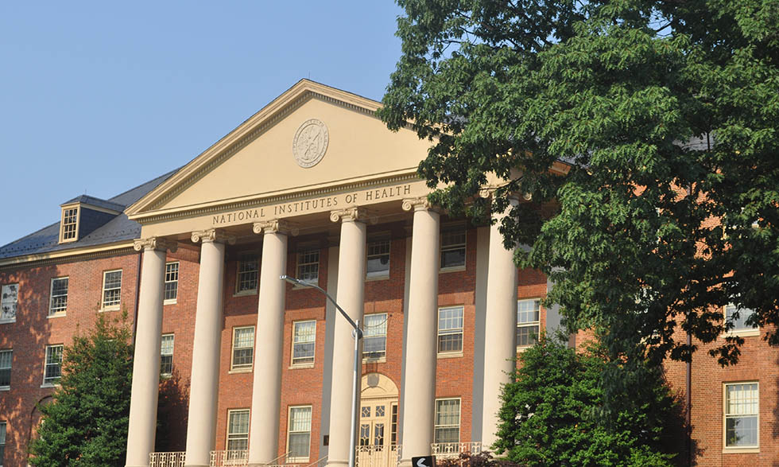
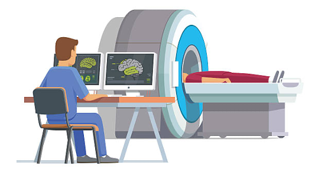
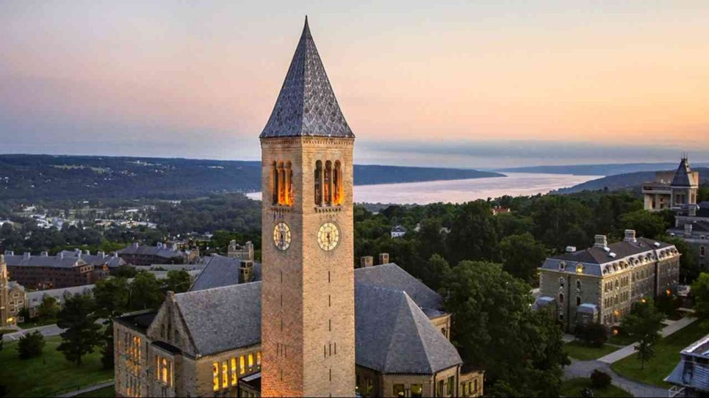
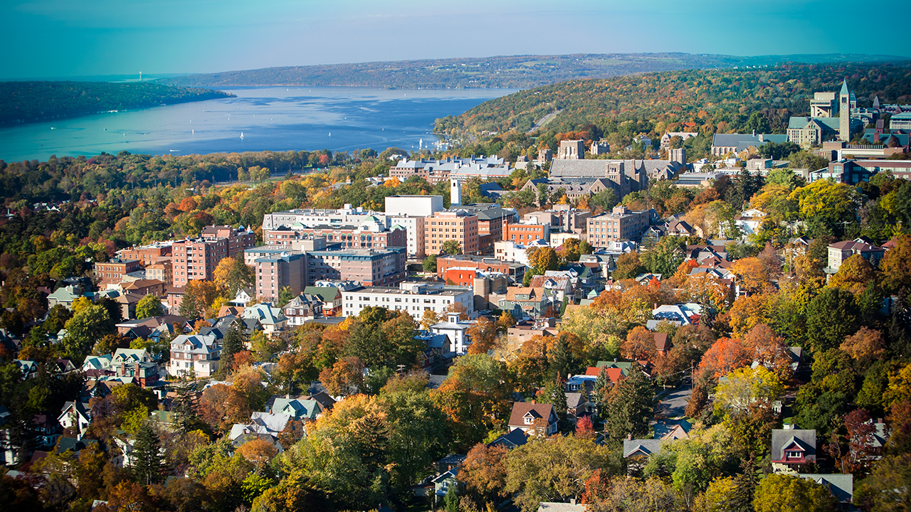

I am a first-year Ph.D. Student in the [Cognitive and Affective Neuroscience program](https://psychology.northwestern.edu/graduate/program-areas/cognitive-affective-neuroscience/) in the Department of Psychology at Northwestern University. I am working with [Dr. Katie Insel](https://psychology.northwestern.edu/people/faculty/core/profiles/katie-insel.html) in the [Child & Adolescent Translational Science Lab](https://nucatslab.com/#page-0) for my research training. I conduct research using brain imaging and behavioral data to study patterns of adolescents' executive function and cognitive control and how this may be related to the development of psychopathology during this critical time of brain maturation. 

I spent three years following my undergraduate education as a post-baccalaureate fellow at the National Institute of Mental Health. I worked in the [Section on Functional Imaging Methods](https://fim.nimh.nih.gov/) under [Dr. Peter Bandettini](https://www.nimh.nih.gov/research/research-conducted-at-nimh/principal-investigators/peter-bandettini) analyzing functional connectivity in resting-state fMRI and how to leverage connectivity information to enhance brain-behavior predictions. I also had the opportunity to work in the Clinical & Translational Neuroscience Branch under [Dr. Karen Berman](https://www.nimh.nih.gov/research/research-conducted-at-nimh/principal-investigators/karen-berman). There, I conducted research using brain imaging to investigate the relationship between gonadal hormone fluctuations and the the brain at rest in healthy women, men, and women using oral contraceptives.

  
  

I received a B.A. in Psychology from  [Cornell University](https://www.cornell.edu/) in 2021, where I found my love for neuroscience and coding. I worked as an undergraduate research assistant in the [Laboratory of the Neurobiology of Learning and Memory](https://blogs.cornell.edu/davidsmithlab/) under [Dr. David Smith](https://psychology.cornell.edu/david-m-smith), studying the anterior nucleus of the hippocampus using opto-genetics and chemo-genetics. 

  
  

Outside of the lab, I love a good brunch, reading, and watching sports with my family. 