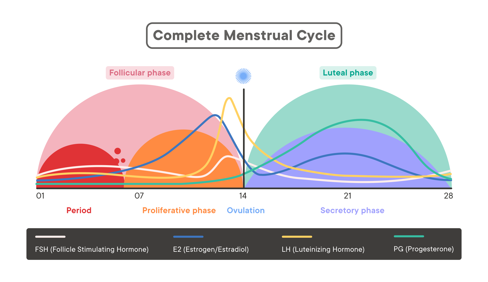

As a NIH post-baccalaureate fellow in the Clinical & Translational Neuroscience Branch under [Dr. Karen Berman](https://www.nimh.nih.gov/research/research-conducted-at-nimh/principal-investigators/karen-berman), I conduct research using structural and functional magnetic resonance imaging (MRI), as well as positron-emission tomography (PET), to investigate the relationship between gonadal hormone fluctuations during the menstrual cycle and the intrinsic resting activity of the brain in healthy women. In addition, I also investigate how this relationship is mediated by exogenous hormone manipulation via oral contraceptive use. 

  
  

I spent two years following my undergraduate education as a post-baccalaureate fellow in the [Section on Functional Imaging Methods](https://fim.nimh.nih.gov/) under [Dr. Peter Bandettini](https://www.nimh.nih.gov/research/research-conducted-at-nimh/principal-investigators/peter-bandettini). During this time, I worked on a multitude of projects analyzing functional connectivity in resting-state fMRI and how to leverage connectivity information to enhance brain-behavior predictions. 

  
  

I received a B.A. in Psychology from  [Cornell University](https://www.cornell.edu/) in 2021, where I found my love for neuroscience and coding. I worked as an undergraduate research assistant in the [Laboratory of the Neurobiology of Learning and Memory](https://blogs.cornell.edu/davidsmithlab/) under [Dr. David Smith](https://psychology.cornell.edu/david-m-smith), studying the anterior nucleus of the hippocampus using opto-genetics and chemo-genetics. 

  
  

Outside of the lab, I love a good brunch, reading, working out, and watching sports with my family. 